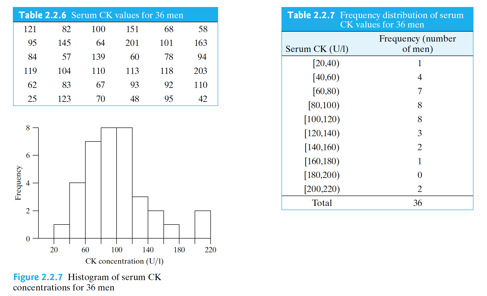
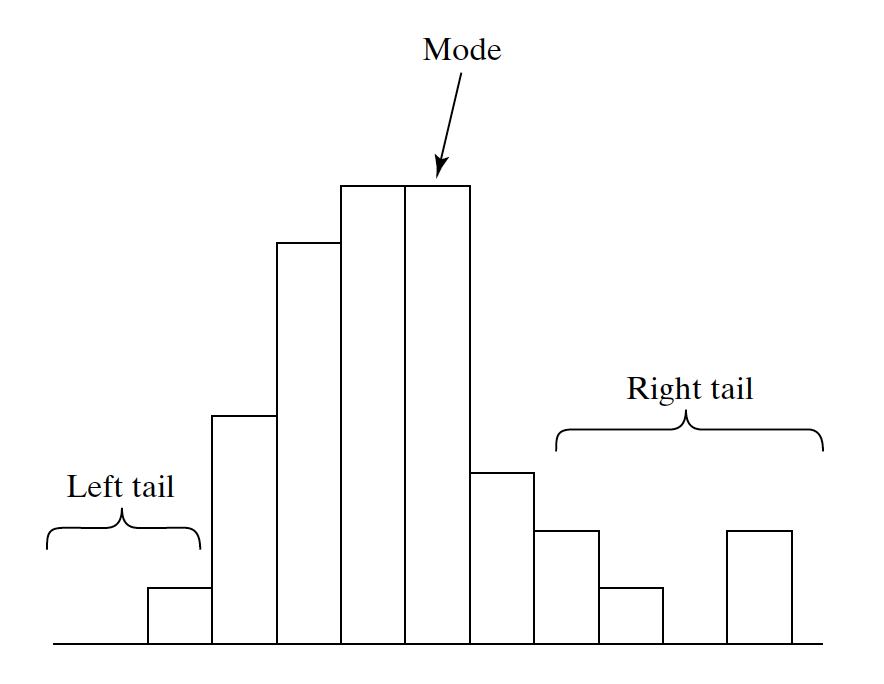
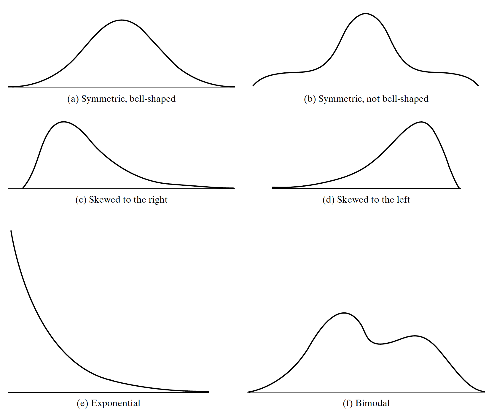
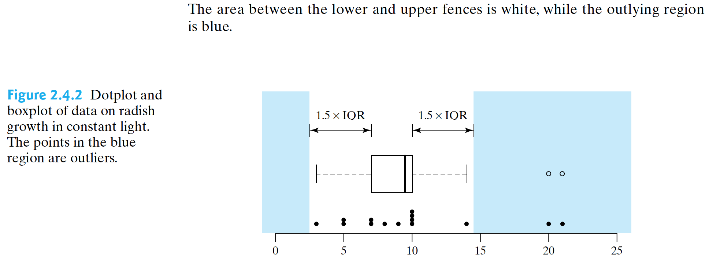

Discussion Time: Tuesday 8:00 -- 8:50 am, Haring Hall 1204.

Notes: https://github.com/Hahahuo-13316/sta100-a01-fall19

**Office hour: Tuesday 12:00 -- 1:00 pm, Mathematical Sciences Building 1117. (Changed this week!)**

Email: yishuang\@ucdavis.edu

```{r setup, include=FALSE}
knitr::opts_chunk$set(echo = TRUE)
```

**Quiz: this Friday in class.**

## Review of Course Materials

### Chapter 1

1. Types of evidences:
- Anecdotal evidences: a short story or event, may leading to furter scientific investigation but *not an evidence of scientific theory*.
- Observational studies vs. experiments:
    - In an observation we collect data from subjects only as observers and without manipulate conditions. But observation studies may produce misleading results due to *confounding variables*. Confounding variable is a special type of variable which may not be considered by the study designer, but it influnces both dependent variables and independent variables. So that it may cause a false causal relationship.
    - In an experiment we *impose* the conditions on subjects. Treatments are randomly assigned to subjects and we make observation on the subjects. For an experiment on human we often use a placebo in order to reduce the influnce of psychological effects. That is because people taking placebos has similar 'placebo responses' as the people taking real treatments. Another important criterion is blinding, which is very essential in human experiments. Blinding means that subjects do not know which group do they participated. To eliminate the observers' first impression, double-blind experiments are always implemented.
    
2. Random Sampling:
- Sample: a subset of the entire population. $n$ is sample size.
- Biased sample: systematical overestimate or underestimate of some characteristics (variables), called sampling bias. Systematic error is opposite to random error (sampling error), where the latter one is unavoidable, appearing in all the sampling procedures and of the experiment result measurements.
- Missing data. Due to death, failure of response by subjects, mistakes in data collecting, etc.

Example Problems:

1.2.7 (b): For each of the following cases [(a) and (b)], (I) state whether the study should be observational or experimental. (II) state whether the study should be run blind, doubleblind, or neither. If the study should be run blind or double-blind, who should be blinded?
(b) An investigation of whether drinking more than 1 liter of water per day helps with weight loss for people who are trying to lose weight.

1.3.3 (b): For each of the following studies, identify the source(s) of sampling bias and describe: (i) how it might affect the study conclusions and (ii) how you might alter the sampling method to avoid the bias.
A nutritionist is interested in the eating habits of college students and observes what each student who enters a dining hall between 8:00 A.M. and 8:30 A.M. chooses for breakfast on a Monday morning.

### Chapter 2

1. Key Concepts:

- Variable($Y$): A variable is a characteristic of a person or a thing that can be assigned a number or a category.
- Observational Units($y$): When we collect a sample of $n$ persons or things and measure one or more variables on them, we call these persons or things observational units or cases.
- Relative Frequency = Frequency / $n$.
- (Grouped) frequency distributions, tails.


- Important properties of data distribution: skewness and shape.

- Measurements of center: mean, mode and medium.
    - Rank position: from the smallest to the largest, numbered as $1, 2, \cdots, n$. Especially, for the median the rank position is $(m + 1)/2$. Where, the $m + 0.5$ position means the average of the $m$ and $m + 1$ position.
- Quantile, percentile: 
    - How to derive quantiles:
        1. First find the medium and cut the (ordered) sample to two halfs. If sample size $n$ is odd, then each half contains $(n - 1)/2$ observations (i.e. the medium is **not** included in either half). If sample size $n$ is even, then each half contains $n/2$ observations.
        2. $Q_1$ is defined as the medium of the smaller half, and $Q_3$ is defined as the medium of the larger half.
    - What is percentile, and the alternative definition of quantiles:
        - $x$-th percentile refers to the rank position $p = (n + 1) \times x\%$. If the position lies between $m$ and $m + 1$, then we take the percentile as the mean of $m$-th and $(m + 1)$-th rank position. For example, if $n = 19$ and we want to take the 55-th percentile, then the position should be $p = (19 + 1) \times 55\% = 11$, i.e, the 11-th number in the small-to-large order. But, if we want to take the 67-th percentile, then the position should be $p = (19 + 1) \times 67\% = 13.4$, i.e, the average number of 13-th number and the 14-th number.
        - In some textbooks, $Q_1$ and $Q_3$ are defined as 25-th and 75-th percentile, respectively. This alternative definition has slight difference to our original definition. So **this definition would not be used in this course, and use the previous definition**.
- Outliers: An outlier is a data point that falls outside of the 'fences'.
\[\begin{split}
\textrm{Lower Fence} &= Q_1 - 1.5 \times IQR; \\
\textrm{Upper Fence} &= Q_3 + 1.5 \times IQR; \\
IQR &= Q_3 - Q_1.
\end{split}\]
- Range: the difference between the largest and smallest observations in a sample.
- Deviation: $\textrm{deviation}_i = y_i - \bar{y}$.
- (Sample) variance and (sample) standard deviation:
\[s^2 = \frac{1}{n - 1}\sum_{i = 1}^n (y_i - \bar{y})^2,\]
where $s$ is the sample standard deviation and $s^2$ is the sample variance.

Why $n - 1$? Since dividing by $n$ seems more natural, you may wonder why the formula for the SD specifies dividing by $n - 1$. Note that the sum of the deviations $y_i - y$ is always zero. Thus, once the first $n - 1$ deviations have been calculated, the last deviation is constrained. This means that in a sample with $n$ observations, there are only $n - 1$ units of information concerning deviation from the average. The quantity $n - 1$ is called the degrees of freedom of the standard deviation or variance. We can also give an intuitive justification of why $n - 1$ is used by considering the extreme case when $n = 1$, as in the following example.

- Typical Percentages (The Empirical Rule): for 'nicely shaped' distributions -- that is, unimodal distributions that are not too skewed and whose tails are not overly long or short -- we usually expect to find
\[\begin{split}
\sim 68\% \;\textrm{observations within}\;& (\textrm{mean}\;\pm1 \;\textrm{SD}); \\
\sim 95\% \;\textrm{observations within}\;& (\textrm{mean}\;\pm2 \;\textrm{SD}); \\
> 99\% \;\textrm{observations within}\;& (\textrm{mean}\;\pm3 \;\textrm{SD}). \\
\end{split}\]

- $z$-score:
\[z_i = \frac{y_i - \bar{y}}{s}.\]


2. Graphs: 

- Bar chart: A bar chart is a graph of *categorical data* showing the number of observations in each category.
- Dotplot: A dotplot is a simple graph that can be used to show the distribution of a *numeric variable* when the sample size is small.
- Histogram: (can be derived from dotplot)
    - Histogram vs. bar chart: Similar looks but very different (in data type, spaces between bars, scales of variables, etc.)
    - A histogram displays a numeric variable, which means that there is a natural order and scale for the variable. In a bar chart the amount of space between the bars (if any) is arbitrary, since the data being displayed are categorical. In a histogram the scale of the variable determines the placement of the bars.
    - Interpretation of histograms:
        - Top of the bars: shape of the distribution.
        - Areas within the bars: proportional to the corresponding frequency.
        - Three types of 'frequency': (normal) **frequency**, **relative frequency** (frequency divided by sample size $n$), density (not required in class, also proportion to frequency, but that the total area of all bars equals to 1).
- Boxplots
    - The first quartile, denoted by $Q_1$, is the median of the data values in the lower half of the data set. 
    - The third quartile, denoted by $Q_3$, is the median of the data values in the upper half of the data set. 
    - The interquartile range is the difference between the first and third quartiles and is abbreviated as $IQR$: $IQR = Q_3 - Q_1$.
    - Five-number summary: The minimum, the maximum, the median, and the quartiles.
    
    

