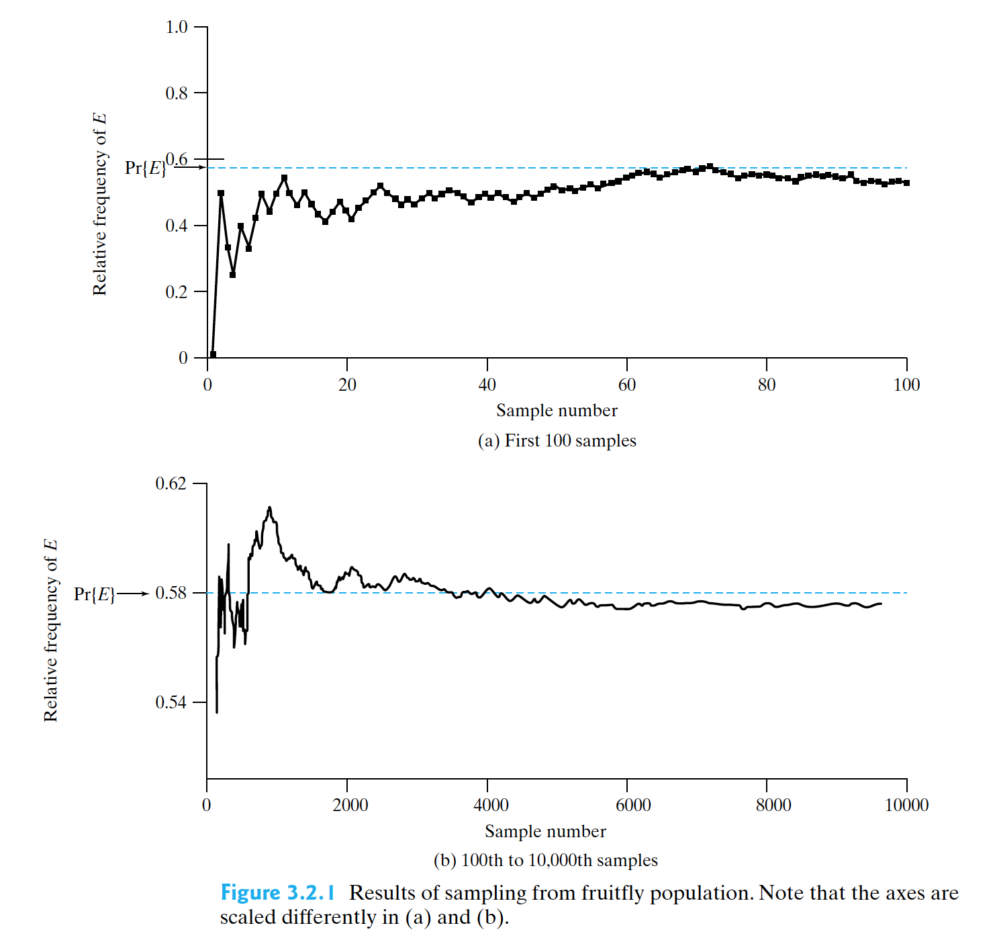
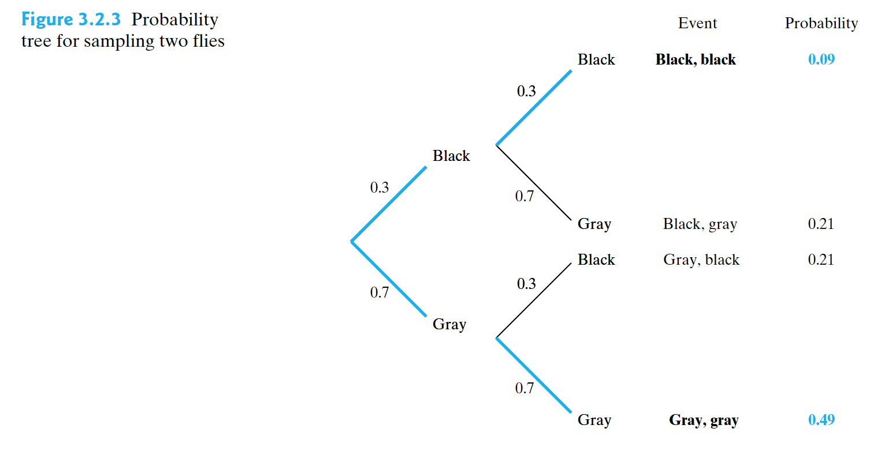
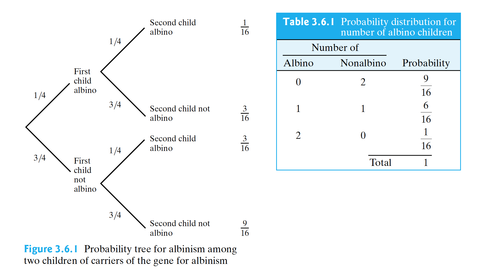
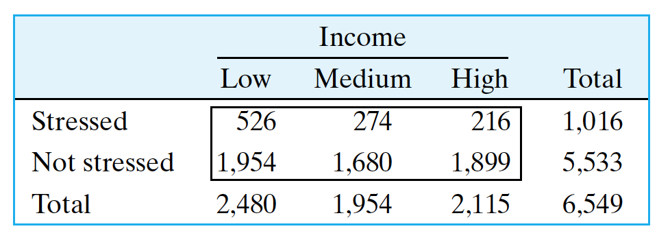
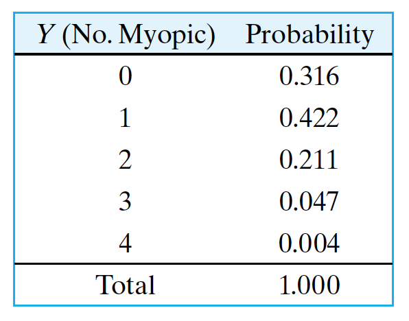

Discussion Time: Tuesday 8:00 -- 8:50 am, Haring Hall 1204.

Notes: https://github.com/Hahahuo-13316/sta100-a01-fall19

Office hour: Tuesday 12:00 -- 1:00 pm, Mathematical Sciences Building 1117.

Email: yishuang\@ucdavis.edu

Quiz: This Friday.

Announcement: We will give back your paper of quiz 1 on discussion sessions. If you have any question on quiz 1, or could not attend discussion to pick up the paper, please go to my office hour or send me an email.

```{r setup, include=FALSE}
knitr::opts_chunk$set(echo = TRUE)
```

## Review of Chapter 3

### Introduction to Probability

- Probability: a probability is a numerical quantity that expresses the likelihood of an event, denoted as $\textrm{Pr}\{E\}$ or just simply, $\mathbb{P}(E)$.
- Frequency interpretation: if a chance operation is repeated a large number of times, each time the chance operation is repeated, the event $E$ either occurs or does not occur. Then
\[\frac{\textrm{Number of times $E$ occurs}}{\textrm{Number of times chance operation is repeated}} \rightarrow \mathbb{P}(E).\]



- Probability tree: useful to analyze a finite series of events, and within each events there are only finite outcomes.



- Propositions:
    - $0 \le \mathbb{P}(E) \le 1$ for any event $E$.
    - Let $E_1, \dots, E_n$ be all possible events, then $\mathbb{P}(E_1) + \dots + \mathbb{P}(E_n) = 1$. (Important notes: here in this definition, 'event' means any one of the possible outcome of an experiment. In a strict definition of probability, an event is defined as a collection of some outcomes of the experiment. Usually, in an experiment that has only finitely or countably many outcomes, every subsets of the whole outcome set is defined as an event. So here 'event' refers to the set of a single outcome in that definition.)
    - $\mathbb{P}(E^C) = 1 - \mathbb{P}(E)$ denotes the probability that event $E$ does not happen.
    - $\mathbb{P}(A \cup B) = \mathbb{P}(A) + \mathbb{P}(B)$ if $A$ and $B$ are disjoint events.
    - $\mathbb{P}(A \cup B) = \mathbb{P}(A) + \mathbb{P}(B) - \mathbb{P}(AB)$ for any two events $A$ and $B$.
    - We call event $A$ and $B$ are independent if and only if $\mathbb{P}(AB) = \mathbb{P}(A)\mathbb{P}(B)$.
    - Conditional probability: the probability of $B$ happening, given that $A$ happened is defined as $\mathbb{P}(B|A)$. We can calculate it by either definition or \[\mathbb{P}(B|A) = \frac{\mathbb{P}(AB)}{\mathbb{P}(A)}.\]
    - Rule of total probability: \[\mathbb{P}(B) = \mathbb{P}(A)\mathbb{P}(B|A) + \mathbb{P}(A^C)\mathbb{P}(B|A^C).\]
    
### Random Variable

- A random variable is a variable that takes on numerical values that depend on the outcome of a chance operation.
- Mean and Variance of $Y$:
\begin{gather*}
\mathbb{E}(Y) = \mu_Y = \sum_i y_i\mathbb{P}(Y = y_i) \\
\textrm{Var}(Y) = \sigma_Y^2 = \sum_i (y_i - \mu_Y)^2\mathbb{P}(Y = y_i)
\end{gather*}
- Propositions of mean of random variable: $\mathbb{E}(X \pm Y) = \mathbb{E}(X) \pm \mathbb{E}(Y)$; $\mathbb{E}(aX + b) = a\mathbb{E}(X) + b$.
- Propositions of variance of random variable: $\textrm{Var}(X \pm Y) = \textrm{Var}(X) + \textrm{Var}(Y)$ if $X$ and $Y$ are independent; $\textrm{Var}(aX + b) = a^2\textrm{Var}(X)$.

### Binomial Distribution

- Model: independent-trials model. A series of $n$ independent trials is conducted. Each trial results in success or failure. The probability of success is equal to the same quantity, $p$, for each trial,
regardless of the outcomes of the other trials.
- If we denote the number of success as $Y$, then $Y$ is a random variable that follows binomial distribution (with parameter $n, p$).



- Propositions:
    - $\mathbb{P}(Y = j) = {n \choose j}p^j (1 - p)^{n - j}$. (This is called probability mass function.)
    - Propositions of binomial coefficients:
        - ${n \choose k} = \frac{n!}{k! (n - k)!}$.
        - ${n \choose n} = {n \choose 0} = 1$.
        - ${n \choose k} = {n \choose n - k}$.
    - Mean and variance of binomial distribution: $\mathbb{E}(Y) = np$, $\textrm{Var}(Y) = np(1 - p)$, standard deviation $\textrm{sd}(Y) = \sqrt{np(1 - p)}$.
    
## Selected Problems

- (3.3.3) In a study of the relationship between health risk and income, a large group of people living in Massachusetts were asked a series of questions. Some of the results are shown in the following table.. Here 'stressed' means that the person reported that most days are extremely stressful or quite stressful; 'not stressed' means that the person reported that most days are a bit stressful, not very stressful, or not at all stressful.
    - What is the probability that someone in this study is stressed?
    - Given that someone in this study is from the high income group, what is the probability that the person is stressed?
    - Compare your answers to the previous two parts. Is being stressed independent of having high income? Why or why not?
    - What is the probability that someone in this study has low income?
    - What is the probability that someone in this study either is stressed or has low income (or both)?
    - What is the probability that someone in this study is stressed and has low income?
    


- (3.5.7) The prevalence of mild myopia (nearsightedness) in adults over age 40 is 25\% in the U.S. Suppose four adults over age 40 are chosen at random from the population; let $Y$ denote the number with myopia out of the four. Then the probability distribution for $Y$ is given by the following table:
    - Find $\mathbb{P}(Y \ge 3)$.
    - Find $\mathbb{P}(Y \le 1)$.
    - Find $\mathbb{P}(Y \ge 1)$.
    - Calculate the mean, $\mu_Y$, of the random variable $Y$.
    
   
    
- (3.6.4) A certain drug treatment cures 90\% of cases of hookworm in children. Suppose that 20 children suffering from hookworm are to be treated, and that the children can be regarded as a random sample from the population. Find the probability that
    - all 20 will be cured.
    - all but 1 will be cured.
    - exactly 18 will be cured.
    - exactly 90\% will be cured.
