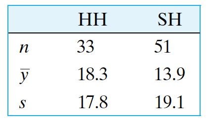

Discussion Time: Tuesday 8:00 -- 8:50 am, Haring Hall 1204.

Notes: https://github.com/Hahahuo-13316/sta100-a01-fall19

Office hour: Tuesday 12:00 -- 1:00 pm, Mathematical Sciences Building 1117.

Email: yishuang\@ucdavis.edu

Quiz: Next Monday.

## Hypothesis testing

- Null hypothesis $H_0$ (from wikipedia): a general statement or default position that there is nothing new happening, like there is no association among groups, or no relationship between two measured phenomena.
- Alternative hypothesis $H_A$: a position that states something is happening, a new theory is true instead of an old one. It is usually consistent with the research hypothesis.
- Test statistics: selected or defined in such a way as to quantify, within observed data, behaviours that would distinguish the null from the alternative hypothesis.
- Type-I error: Reject $H_0$ when $H_0$ is true. Type-I error rate: significant level $\alpha$.
- Type-II error: Accept $H_0$ when $H_0$ is false.
- $p$-value: the probability of obtaining test results at least as extreme as the results actually observed during the test, assuming that the null hypothesis is correct.

## When $df$ is large, student's $t$ distribution is close to standard normal distribution

In fact, when sample size $n \ge 30$, then the $t$ distribution $t_{n - 1}$ with $n - 1$ degrees of freedom is very close to the standard normal distribution $N(0, 1)$. Hence in that case we can use quantile $z^{(q)}$ instead of $t_{n - 1}^{(q)}$ for $0 \le q \le 1$; that is, we can perform $z$ test instead.

## Example: one-sided Student's $t$-test

- Suppose there are a sample $Y_1, \dots, Y_n$ from a normal population with mean $\mu$ and variance $\sigma^2$ (unknown), and we want to know if it is true that $\mu > \mu_0$. Then we set up $H_0: \mu = \mu_0$ vs. $H_A: \mu > \mu_0$. Here we use the null hypothesis as $\mu = \mu_0$ instead of $\mu \le \mu_0$ in order to make the model under $H_0$ easier.

- The test statistics is
\[t_s = \frac{\bar{Y} - \mu_0}{\textrm{SE}_{\bar Y}}, \quad \textrm{SE}_{\bar Y} = \sqrt{\frac{\textrm{sample variance of } Y}{n}}.\]

- We know that $t_s$ follows $t$ distribution with $n - 1$ degrees of freedom. Hence, given significant level $\alpha$, we know that we should reject $H_0$ with too large $t_s$, that is
\[t_s > t_{n - 1}^{(1 - \alpha)}.\]

- If it is true that $\mu \le \mu_0$ but we also have $t_s > t_{n - 1}^{(1 - \alpha)}$, then we call it type-I error; Otherwise if $\mu > \mu_0$ but we also have $t_s \le t_{n - 1}^{(1 - \alpha)}$, then we call it type-II error.

- The $p$-value is the probability $p$ such that $t_s = t_{n - 1}^{(1 - p)}$.

## Example: two-sided Student's $t$-test

- **The difference between two-siede and one-sided test**: when we simply want to know if $\mu = \mu_0$ is true, and the true $\mu$ may be either larger or smaller than $\mu_0$, then we should choose two-sided test; if our research process supposes that $\mu$ seems very likely to be larger, or what we really care about is if $\mu$ is larger than $\mu_0$, then we should use the one-sided test and set the alternative as $\mu > \mu_0$.

- Suppose there are a sample $Y_1, \dots, Y_n$ from a normal population with mean $\mu$ and variance $\sigma^2$ (unknown), and we want to know if it is true that $\mu = \mu_0$. Then we set up $H_0: \mu = \mu_0$ vs. $H_A: \mu \neq \mu_0$.

- The test statistics is the same as the one-sided test:
\[t_s = \frac{\bar{Y} - \mu_0}{\textrm{SE}_{\bar Y}}, \quad \textrm{SE}_{\bar Y} = \sqrt{\frac{\textrm{sample variance of } Y}{n}}.\]

- We know that $t_s$ follows $t$ distribution with $n - 1$ degrees of freedom. Hence, given significant level $\alpha$, we know that we should reject $H_0$ with too large $t_s$, that is
\[|t_s| > t_{n - 1}^{(1 - \alpha/2)}.\]
Notice that this is different from the one-sided situation: for each side we have the quantile $1 - \alpha$, but here divided by 2 because there is $\alpha / 2$ significance on each tail.

- If it is true that $\mu = \mu_0$ but we also have $t_s > t_{n - 1}^{(1 - \alpha/2)}$, then we call it type-I error; Otherwise if $\mu \neq \mu_0$ but we also have $t_s \le t_{n - 1}^{(1 - \alpha/2)}$, then we call it type-II error.

- The $p$-value is the probability $p$ such that $t_s = t_{n - 1}^{(1 - p/2)}$ or $t_s = t_{n - 1}^{(p/2)}$.

## Dealing with paired sample

Assume that we have a paired sample $(X_i, Y_i)_{i = 1}^n$ from a large population. If we need to test whether $H_0: \mu_{X} - \mu_{Y} = c$ is true, we can let $D_i = X_i - Y_i$, and then perform the one-sided or two-sided $t$-test on $D_i$, with hypothesis $H_0: \mu_D = c$. (Here, without further condition we can just assume $X - Y$ follows some normal distribution, for a ramdom $(X, Y)$ from the population.)

## How to perform $z$-test on proportion

- Suppose there is a subgroup in a large population, and each individual has probability $p$ to be in that population, independently. Now draw a random sample of size $n \,(\ge 30)$ from that population, with $k$ of them within that subgroup. Then how to perform a one-sided (or two-sided) test on $p$?

- One sided: $H_0: t = t_0$ vs. $H_A: t > t_0$. (or, $t < t_0$, but we take $t > t_0$ as an example).
Two sided: $H_0: t = t_0$ vs. $H_A: t \neq t_0$.

- $\hat{p} = k/n$, $\hat{q} = 1 - \hat{p} = (n - k) / n$. Test statistics is
\[z_s = \frac{\hat{p} - p_0}{\textrm{SE}_{\hat{p}}}, \quad \textrm{SE}_{\hat{p}} = \sqrt{\frac{\hat{p}\hat{q}}{n}} = \sqrt{\frac{\hat{p}(1 - \hat{p})}{n}}.\]

- $z_s$ approximately follows standard normal distribution for $n \ge 30$. Hence, given significant level $\alpha$, we know that we should reject $H_0$ with too large $z_s$, that is for two-sided:
\[|z_s| > z^{(1 - \alpha/2)};\]
and for one-sided:
\[z_s > z^{(1 - \alpha)}.\]

- The $p$-value is the probability $p$ such that $z_s = z^{(1 - p/2)}$ or $z_s = z^{(p/2)}$ for two-sided; it is the probability $p$ such that $z_s = z^{(1 - p)}$ for one sided.

## Problems

- (7.2.5) In a study of the nutritional requirements of cattle, researchers measured the weight gains of cows during a 78-day period. For two breeds of cows, Hereford (HH) and Brown Swiss/Hereford (SH), the results are summarized in the following table. 
    - (a) What is the value of the $t$ test statistic for comparing the means?
    - (b) In the context of this study, state the null and alternative hypotheses.
    - (c) The $P$-value for the $t$ test is 0.29. If $\alpha = 0.10$, what is your conclusion regarding the hypotheses in (b)?

- (7.3.8) A dairy researcher has developed a new technique for culturing cheese that is purported to age cheese in substantially less time than traditional methods without affecting other properties of the cheese. Retrofitting cheese manufacturing plants with this new technology will initially cost millions of dollars, but if it indeed reduces aging time -- even marginally -- it will lead to higher company profits in the long run. If, on the other hand, the new method is no better than the old, the retrofit would be a financial mistake. Before making the decision to retrofit, an experiment will be performed to compare culture times of the new and old methods.
    - (a) In plain English, what are the null and alternative hypotheses for this experiment?
    - (b) In the context of this scenario, what would be the consequence of a Type I error?
    - (c) In the context of this scenario, what would be the consequence of a Type II error?
    - (d) In your opinion, which type of error would be more serious? Justify your answer. (It is possible to argue both sides.)

- (7.9.1) Suppose we have conducted a $t$ test, with $\alpha = 0.05$, and the $P$-value is 0.04. For each of the following statements, say whether the statement is true or false and explain why.
    - (a) There is a $4\%$ chance that $H_0$ is true.
    - (b) We reject $H_0$ with $\alpha = 0.05$.
    - (c) We should reject $H_0$, and if we repeated the experiment, there is a $4\%$ chance that we would reject $H_0$ again.
    - (d) If $H_0$ is true, the probability of getting a test statistic at least as extreme as the value of the ts that was actually obtained is $4\%$.

- (8.2.2) In an experiment to compare two diets for fattening beef steers, nine pairs of animals were chosen from the herd; members of each pair were matched as closely as possible with respect to hereditary factors. The members of each pair were randomly allocated, one to each diet. The following table shows the weight gains (lb) of the animals over a 140-day test period on diet 1 ($Y_1$) and on diet 2 ($Y_2$).
    - (a) Calculate the standard error of the mean difference.
    - (b) Test for a difference between the diets using a paired $t$ test at $\alpha = 0.10$. Use a nondirectional alternative.
    - (c) Construct a 90% confidence interval for $\mu_D$.
    - (d) Interpret the confidence interval from part (c) in the context of this setting.
    

