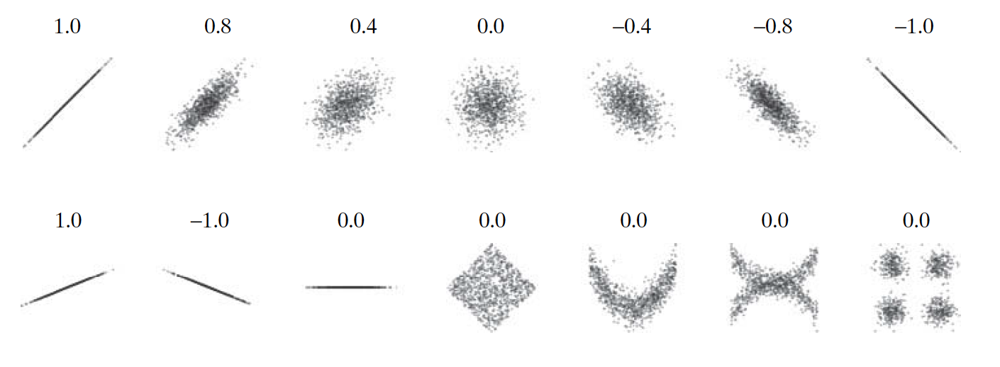
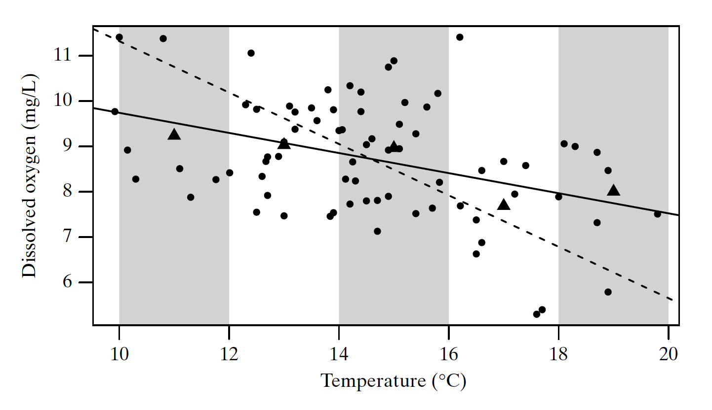

Discussion Time: Tuesday 8:00 -- 8:50 am, Haring Hall 1204.

Notes: https://github.com/Hahahuo-13316/sta100-a01-fall19

Office hour: Tuesday 12:00 -- 1:00 pm, Mathematical Sciences Building 1117.

Email: yishuang\@ucdavis.edu

## Linear regression

- Sample: $(x_i, y_i)$, $i = 1, \cdots, n$, $n$ is sample size.
- Correlation coefficient:
\[r = \frac{1}{n - 1} \sum_{i = 1}^n \left(\frac{x_i - \bar x}{s_x}\right)\left(\frac{y_i - \bar y}{s_y}\right) = \frac{\sum (x_i - \bar x)(y_i - \bar y)}{\sqrt{\sum (x_i - \bar x)^2 \cdot \sum (y_i - \bar y)^2}}.\]
Where,
\[s_x^2 = \frac{1}{n - 1}\sum_{i = 1}^n (x_i - \bar x)^2, \quad s_y^2 = \frac{1}{n - 1}\sum_{i = 1}^n (y_i - \bar y)^2.\]



- Least square fitting: We use the line $y = b_0 + b_1x$ to fit the observations, and find $b_0$ and $b_1$ to minimize $\sum (y_i - \hat y_i)^2$, where $\hat y_i = b_0 + b_1x_i$, are the fitted value of $y_i$. The result is
\[b_1 = r\cdot \frac{s_y}{s_x} = \frac{\sum (x_i - \bar x)(y_i - \bar y)}{\sum (x_i - \bar x)^2}, \quad b_0 = \bar y - b_1 \bar x.\]

In the following scatter plot, the solid line is the least square fitted line.



## Use software to make inference on linear model

- Model: $Y = \beta_0 + \beta_1X_1 + \dots + \beta_nX_n$.

```{r}
mtcars
fit <- lm(mpg ~ cyl + disp + hp + drat + wt + qsec, data = mtcars)
summary(fit)
```

## Interpret linear regression summary in MINITAB

You may see the following summary in a MINITAB linear regression, taken from the website https://support.minitab.com/en-us/minitab/18/help-and-how-to/modeling-statistics/regression/how-to/fit-regression-model/before-you-start/example/. It is quite similar to the summary in R.

```{}
Regression Equation
Rating = -0.756 + 0.1545 Conc + 0.2171 Ratio + 0.01081 Temp + 0.0946 Time

Term         Coef  SE Coef  T-Value  P-Value
Constant   -0.756    0.736    -1.03    0.314
Conc       0.1545   0.0633     2.44    0.022
Ratio      0.2171   0.0316     6.86    0.000
Temp      0.01081  0.00462     2.34    0.027
Time       0.0946   0.0546     1.73    0.094

Model Summary
       S    R-sq  R-sq(adj)
0.811840  72.92%     68.90%

Analysis of Variance
Source         DF       SS       MS  F-Value  P-Value
Regression      4  47.9096  11.9774    18.17    0.000
Error          27  17.7953   0.6591
Total          31  65.7049
```

- The coefficients in the regression equation is the estimated coefficients of our linear model, $\hat \beta_i$. We can use the regression equation to make prediction, by just plug in the new observed $x$ values and gain the estimated $y$ value on the left hand side.

- To test whether $\beta_i = 0$ for a specified $i \in \{0, 1, \cdots, k\}$, we can compare the p-value given by the corresponding row in the middle table, and the required significant level. We reject the null hypothesis $H_0: \beta_i = 0$ if the corresponding p-value is less than the required significant level $\alpha$. Otherwise, we do not reject $H_0$.

- $R^2$ **is the proportion of the variance in the dependent variable** ($Y$) **that is predictable from the independent variable(s)** ($X$), and adjusted $R^2$ **is not**. 

## How to insert new predictors into a dataframe

```{r}
mtcars.new <- mtcars
mtcars.new$cyl.greater.4 <- as.integer(mtcars$cyl > 4)
mtcars.new[c("cyl", "cyl.greater.4")]
```

## Last things: the materials not covered by the discussion notes

- stem-and-leaf plots:

```{r}
a <- sort(round(runif(100) * 100))
a
stem(a)
```

- More hypothesis testing:
    - Two-sample $t$-test (and with large sample size, $z$-test) of the difference of population mean (Section 7.1 -- 7.5);
    - Two-sample $z$-test for difference of proportion;